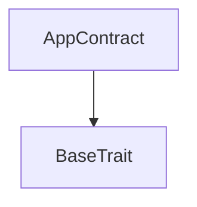
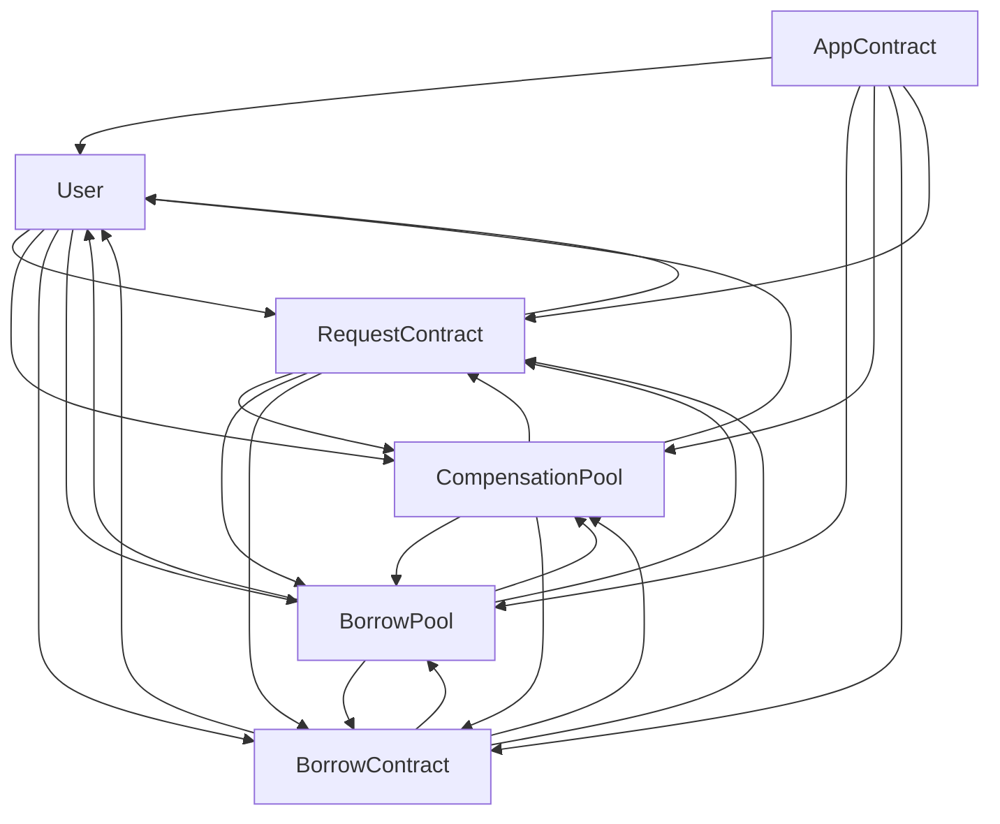

# Tact compilation report
Contract: AppContract
BoC Size: 5120 bytes

## Structures (Structs and Messages)
Total structures: 47

### DataSize
TL-B: `_ cells:int257 bits:int257 refs:int257 = DataSize`
Signature: `DataSize{cells:int257,bits:int257,refs:int257}`

### SignedBundle
TL-B: `_ signature:fixed_bytes64 signedData:remainder<slice> = SignedBundle`
Signature: `SignedBundle{signature:fixed_bytes64,signedData:remainder<slice>}`

### StateInit
TL-B: `_ code:^cell data:^cell = StateInit`
Signature: `StateInit{code:^cell,data:^cell}`

### Context
TL-B: `_ bounceable:bool sender:address value:int257 raw:^slice = Context`
Signature: `Context{bounceable:bool,sender:address,value:int257,raw:^slice}`

### SendParameters
TL-B: `_ mode:int257 body:Maybe ^cell code:Maybe ^cell data:Maybe ^cell value:int257 to:address bounce:bool = SendParameters`
Signature: `SendParameters{mode:int257,body:Maybe ^cell,code:Maybe ^cell,data:Maybe ^cell,value:int257,to:address,bounce:bool}`

### MessageParameters
TL-B: `_ mode:int257 body:Maybe ^cell value:int257 to:address bounce:bool = MessageParameters`
Signature: `MessageParameters{mode:int257,body:Maybe ^cell,value:int257,to:address,bounce:bool}`

### DeployParameters
TL-B: `_ mode:int257 body:Maybe ^cell value:int257 bounce:bool init:StateInit{code:^cell,data:^cell} = DeployParameters`
Signature: `DeployParameters{mode:int257,body:Maybe ^cell,value:int257,bounce:bool,init:StateInit{code:^cell,data:^cell}}`

### StdAddress
TL-B: `_ workchain:int8 address:uint256 = StdAddress`
Signature: `StdAddress{workchain:int8,address:uint256}`

### VarAddress
TL-B: `_ workchain:int32 address:^slice = VarAddress`
Signature: `VarAddress{workchain:int32,address:^slice}`

### BasechainAddress
TL-B: `_ hash:Maybe int257 = BasechainAddress`
Signature: `BasechainAddress{hash:Maybe int257}`

### Deploy
TL-B: `deploy#946a98b6 queryId:uint64 = Deploy`
Signature: `Deploy{queryId:uint64}`

### DeployOk
TL-B: `deploy_ok#aff90f57 queryId:uint64 = DeployOk`
Signature: `DeployOk{queryId:uint64}`

### FactoryDeploy
TL-B: `factory_deploy#6d0ff13b queryId:uint64 cashback:address = FactoryDeploy`
Signature: `FactoryDeploy{queryId:uint64,cashback:address}`

### AddTelegramId
TL-B: `add_telegram_id#688f23fb id:uint256 = AddTelegramId`
Signature: `AddTelegramId{id:uint256}`

### ChangeVal
TL-B: `change_val#38078971 val:uint8 newVal:^cell = ChangeVal`
Signature: `ChangeVal{val:uint8,newVal:^cell}`

### SendData
TL-B: `send_data#88ffc040 val:uint8 data:^cell = SendData`
Signature: `SendData{val:uint8,data:^cell}`

### RequestContract$Data
TL-B: `_ address:address pool:uint256 app:address = RequestContract`
Signature: `RequestContract{address:address,pool:uint256,app:address}`

### BorrowContract$Data
TL-B: `_ id:uint32 address:address createdTime:uint32 pool:uint256 sum:coins app:address endTime:uint64 = BorrowContract`
Signature: `BorrowContract{id:uint32,address:address,createdTime:uint32,pool:uint256,sum:coins,app:address,endTime:uint64}`

### User$Data
TL-B: `_ address:address telegramId:Maybe int257 rating:int257 app:address debts:dict<uint32, ^Debt{sum:coins,timetoreturn:uint32,borrowPool:uint256,compPool:uint256,commision:coins,fcc:coins}> investedIn:dict<address, ^CompPoolData{v:uint32,freezed:coins,address:address,balance:coins,earnCoff:uint32,freezeCoff:uint32}> compensationPools:dict<uint256, address> debtId:uint32 = User`
Signature: `User{address:address,telegramId:Maybe int257,rating:int257,app:address,debts:dict<uint32, ^Debt{sum:coins,timetoreturn:uint32,borrowPool:uint256,compPool:uint256,commision:coins,fcc:coins}>,investedIn:dict<address, ^CompPoolData{v:uint32,freezed:coins,address:address,balance:coins,earnCoff:uint32,freezeCoff:uint32}>,compensationPools:dict<uint256, address>,debtId:uint32}`

### Overdue
TL-B: `overdue#d3c8679f address:address sum:coins id:uint32 = Overdue`
Signature: `Overdue{address:address,sum:coins,id:uint32}`

### Time
TL-B: `time#a6872347 address:address id:uint16 pool:uint16 = Time`
Signature: `Time{address:address,id:uint16,pool:uint16}`

### Changesum
TL-B: `changesum#030514b1 sum:coins = Changesum`
Signature: `Changesum{sum:coins}`

### Borrow
TL-B: `borrow#1879d5e1 idBorrow:uint256 idComp:uint256 amount:coins time:Maybe int257 to:address fcc:coins = Borrow`
Signature: `Borrow{idBorrow:uint256,idComp:uint256,amount:coins,time:Maybe int257,to:address,fcc:coins}`

### InitBorrow
TL-B: `init_borrow#69c9e7e5 endTime:uint32 sum:coins = InitBorrow`
Signature: `InitBorrow{endTime:uint32,sum:coins}`

### CheckTime
TL-B: `check_time#0fd66c7c  = CheckTime`
Signature: `CheckTime{}`

### Close
TL-B: `close#b368a678  = Close`
Signature: `Close{}`

### Update
TL-B: `update#9044198f sender:address = Update`
Signature: `Update{sender:address}`

### Unfreeze
TL-B: `unfreeze#87de5ed3 v:uint256 fcc:coins id:uint256 = Unfreeze`
Signature: `Unfreeze{v:uint256,fcc:coins,id:uint256}`

### UpdateEarn
TL-B: `update_earn#22d38d52 sender:address = UpdateEarn`
Signature: `UpdateEarn{sender:address}`

### Repay
TL-B: `repay#68939123 id:uint256 = Repay`
Signature: `Repay{id:uint256}`

### Request
TL-B: `request#52df2fba id:uint256 user:address = Request`
Signature: `Request{id:uint256,user:address}`

### Approve
TL-B: `approve#8d887dd5 id:int257 user:address = Approve`
Signature: `Approve{id:int257,user:address}`

### Decline
TL-B: `decline#94afcacd id:int257 user:address = Decline`
Signature: `Decline{id:int257,user:address}`

### Withdraw
TL-B: `withdraw#0abf5c5f from:int257 from2:address amount:coins to1:address = Withdraw`
Signature: `Withdraw{from:int257,from2:address,amount:coins,to1:address}`

### WithdrawFromComp
TL-B: `withdraw_from_comp#c4419947 from:int257 from2:address amount:coins to1:address = WithdrawFromComp`
Signature: `WithdrawFromComp{from:int257,from2:address,amount:coins,to1:address}`

### InitCompensationPool
TL-B: `init_compensation_pool#05ae90f1 name:^string maxTime:uint32 = InitCompensationPool`
Signature: `InitCompensationPool{name:^string,maxTime:uint32}`

### CreateBorrowPool
TL-B: `create_borrow_pool#51757359 name:^string maxTime:uint32 = CreateBorrowPool`
Signature: `CreateBorrowPool{name:^string,maxTime:uint32}`

### CreateCompensationPool
TL-B: `create_compensation_pool#9b407b7d name:^string maxTime:uint32 = CreateCompensationPool`
Signature: `CreateCompensationPool{name:^string,maxTime:uint32}`

### Login
TL-B: `login#5ee94f23  = Login`
Signature: `Login{}`

### Deposit
TL-B: `deposit#1e4758c2 id:uint32 sender:address = Deposit`
Signature: `Deposit{id:uint32,sender:address}`

### DepositToComp
TL-B: `deposit_to_comp#8a6d35fc id:uint32 sender:address = DepositToComp`
Signature: `DepositToComp{id:uint32,sender:address}`

### InitBorrowPool
TL-B: `init_borrow_pool#45273be3 name:^string maxTime:uint32 = InitBorrowPool`
Signature: `InitBorrowPool{name:^string,maxTime:uint32}`

### Debt
TL-B: `_ sum:coins timetoreturn:uint32 borrowPool:uint256 compPool:uint256 commision:coins fcc:coins = Debt`
Signature: `Debt{sum:coins,timetoreturn:uint32,borrowPool:uint256,compPool:uint256,commision:coins,fcc:coins}`

### CompPoolData
TL-B: `_ v:uint32 freezed:coins address:address balance:coins earnCoff:uint32 freezeCoff:uint32 = CompPoolData`
Signature: `CompPoolData{v:uint32,freezed:coins,address:address,balance:coins,earnCoff:uint32,freezeCoff:uint32}`

### BorrowPool$Data
TL-B: `_ id:uint32 name:^string maxTime:uint32 app:address acc:coins v:uint32 = BorrowPool`
Signature: `BorrowPool{id:uint32,name:^string,maxTime:uint32,app:address,acc:coins,v:uint32}`

### CompensationPool$Data
TL-B: `_ id:uint32 name:^string maxTime:uint32 app:address freezed:coins acc:uint32 v:uint32 fcc:coins = CompensationPool`
Signature: `CompensationPool{id:uint32,name:^string,maxTime:uint32,app:address,freezed:coins,acc:uint32,v:uint32,fcc:coins}`

### AppContract$Data
TL-B: `_ nowId:uint256 = AppContract`
Signature: `AppContract{nowId:uint256}`

## Get methods
Total get methods: 3

## usersData
Argument: address

## borrowPools
Argument: id

## compPools
Argument: id

## Exit codes
* 2: Stack underflow
* 3: Stack overflow
* 4: Integer overflow
* 5: Integer out of expected range
* 6: Invalid opcode
* 7: Type check error
* 8: Cell overflow
* 9: Cell underflow
* 10: Dictionary error
* 11: 'Unknown' error
* 12: Fatal error
* 13: Out of gas error
* 14: Virtualization error
* 32: Action list is invalid
* 33: Action list is too long
* 34: Action is invalid or not supported
* 35: Invalid source address in outbound message
* 36: Invalid destination address in outbound message
* 37: Not enough Toncoin
* 38: Not enough extra currencies
* 39: Outbound message does not fit into a cell after rewriting
* 40: Cannot process a message
* 41: Library reference is null
* 42: Library change action error
* 43: Exceeded maximum number of cells in the library or the maximum depth of the Merkle tree
* 50: Account state size exceeded limits
* 128: Null reference exception
* 129: Invalid serialization prefix
* 130: Invalid incoming message
* 131: Constraints error
* 132: Access denied
* 133: Contract stopped
* 134: Invalid argument
* 135: Code of a contract was not found
* 136: Invalid standard address
* 138: Not a basechain address
* 8610:
* 14711: Not enought rights
* 26744: You must obtain permission from the Compensation Pool.
* 28284: Not enough TON sent
* 30382: You must obtain permission from this Compensation Pool.
* 40092: Not enought funds
* 40420: Not enought rights!
* 41253: Not enought funs!
* 42972: Not enough rights
* 55621: Your rating only allows you to take less than 2
* 56619: Insufficient funds for deploy
* 56672: You dont have enought rights in this pool
* 57255: Not enough rights!
* 63522: Not enought funds!

## Trait inheritance diagram

## Contract dependency diagram

